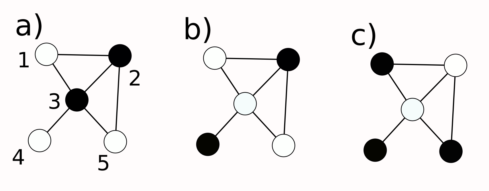
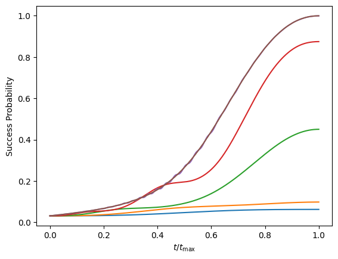

# quantum-optimisation
Applying Quantum Algorithms to solve classical optimisation problems. 

## Quantum Adiabatic Algorithm: Maximum Independent Set

### Maximum Independent Set

<figure>
    
    <figcaption><i>Fig. 1: Example of the Maximum Independent Set problem. a) A set of vertices which aren't independent. b) a set of vertices which are independent but not the maximum independent set. c) the maximum independent set for this graph</i></figcaption>
</figure>
Consider a graph of vertices connected by edges, like that in Fig. 1. The maximum independent is the set with the most coloured vertices, where no two coloured vertices are connected by an edge.

### Quantum Adiabatic Algorithm

Adiabatic Quantum Computing is a branch of analogue quantum computing based on the adiabatic theorem of quantum mechanics. That is, *a physical system remains in its eigenstate if a giving perturbation is acting slowly enough and there is a gap betweent the eigenvalue and the rest of the Hamiltonian's spectrum*.

A Hamiltonian is found with ground state describing the solution to the proplem of interest. This Hamiltonian is likely complicated, we cannot find the ground state easily for large graphs (brute force calculation too slow, Hamiltonian will have dimensions $2^n \times 2^n$ for $n$ vertices). Instead, the system is prepared in the known ground state of a simpler Hamiltonian, and adiabatically evolved to the desired problem Hamiltonian. The adiabatic theorem means the system will be in the ground state of the problem Hamiltonian, so the problem can be solved by simply measuring the state. 

### The Ising Model

We use the Ising Model to map the problem to a Hamiltonian, 
$$
H_{\mathrm{Ising}} = \sum_{k = 1}^n \sum_{j = k + 1} ^ n J_{kj} \sigma_k^z \sigma_j^z + \sum_{j=1}^n h_j \sigma_j^z,
$$
where $J = M$, and
$$
h_k = -\sum_{j=1}^n(M_{kj} + M_{jk}) + \kappa.
$$

With $\kappa \in (0, 1)$ some constant added to reward the colouring of more vertices.  

### The Time-Dependent Hamiltionian

We define the time-dependent Hamiltonian as 

$$
H(t) = -A(t) \sum_j \sigma_j^x + B(t)H_{\mathrm{Ising}},
$$

where $A(t) = 1 - t/t_{\mathrm{max}}$ and $B(t) = t/t_{\mathrm{max}}$ are the time-dependent controls, and 

$$
\sigma^x_j = \left(\bigotimes_{k=1}^{j-1} I_2\right) \otimes \sigma^x \otimes \left(\bigotimes_{k=J=1}^{n} I_2\right),
$$

where $\sigma^x = \begin{pmatrix}0 & 1 \\ 1 & 0 \end{pmatrix}$ is the Pauli matrix, and $I_2$ the $2\times2$ identity matrix.

### Example problem

Our goal is to simulate the Quantum Adiabatic Algorithm solving a small instance of Maximum Independent Set on the graph in *Fig. 1*, defined by the adjacency matrix

$$ 
M = \begin{pmatrix}
0 & 1 & 1 & 0 & 0 \\
0 & 0 & 1 & 0 & 1 \\
0 & 0 & 0 & 1 & 1 \\
0 & 0 & 0 & 0 & 0 \\
0 & 0 & 0 & 0 & 0 
\end{pmatrix}  .
$$
 
We set $\kappa = 0.5$, and run the algorithm for 5 values of $t_\mathrm{max}$

### Results

<figure>
    
    <figcaption><i>Fig. 2: Success probability against time for solving the example graph for different values of tmax: 1 (blue), 2 (orange), 5 (green), 10 (red), 100 (purple). </i></figcaption>
</figure>

Fig. 2 shows the success probability against time for the above problem. 

Success probability is calculated as the probability of finding the system in the expected ground state for this example,

$$
P = \left | \langle \phi_0 | \phi(t) \rangle \right |^2,
$$

where $|\phi_0\rangle$ is the expected ground state, and $| \phi(t) \rangle $ is the wavefunction of the system at time $t$. 
